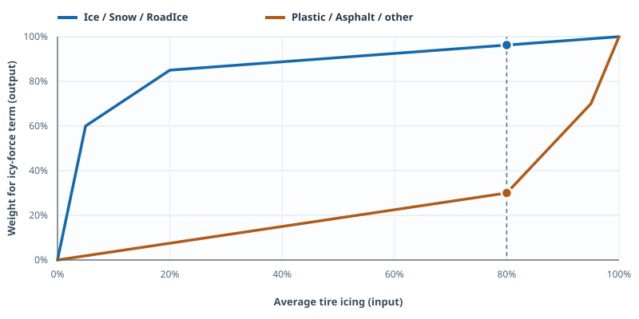

# Trackmania gorilla grip research

This repository contains the [mechanism report](outputs/gorilla_grip_mechanism.md) and scripts used to investigate instant ice-slide grip in the current Trackmania physics build. The report identifies a car-level slide-direction state, a strict ±0.1 threshold on smoothed steering, a 300 ms neutral timeout, and an any-wheel contact condition. It also compares clean tarmac with icy tires on plastic and explains why a short return to neutral preserves the direction but temporarily reduces the force multiplier.

## Interactive graphs

Download or clone the repository, then open [graphs/interactive.html](graphs/interactive.html) in a browser. It works offline with no install or external scripts. Six interactive graphs let you change the icing level, wetness, takeoff contact deadline, steering amount, time before landing, and neutral-steering duration. The page keeps **tire icing**, **the weight of the icy tire-force contribution**, **stored direction**, and **the tire-force multiplier** visibly separate.

The SVG previews open directly on GitHub:

- [Icing versus force weight](graphs/static/icing-force-mix.svg)
- [Icing buildup and decay](graphs/static/icing-over-time.svg)
- [Steering threshold before takeoff](graphs/static/steering-before-takeoff.svg)
- [Force target versus steering](graphs/static/steering-force-target.svg)
- [Force recovery after a direction change](graphs/static/force-recovery.svg)
- [300 ms neutral-steering timeout](graphs/static/neutral-steering-timeout.svg)

At the dotted 80% icing example, the blue curve gives the icy-force term a **96.25% weight** on Ice/Snow/RoadIce, while the orange curve gives it a **30% weight** on Plastic/Asphalt. The remaining weight goes to an ordinary force contribution in this calculation. Neither number is total grip or speed.

The charts use the tested build's values and state their simplifying assumptions. Run `node --test graphs/model.test.js` to check the numerical examples and `node graphs/export-static.js` to regenerate the SVG previews from the interactive renderer.

## Related plugin

[Gorilla Grip Trainer](https://github.com/Teuflum/Gorilla-Grip-Trainer) is the separate Openplanet plugin project. Its specification and implementation plan cover exact steering telemetry, timing grades, movable widgets, local audio, and run history.

## Included

- `outputs/GorillaGripLogger/`: an Openplanet logger for visible vehicle and wheel telemetry. It requires the Openplanet **VehicleState** dependency.
- `work/tick_client.py`, `work/tick_events.py`, `work/setup_tick_automation.py`, and `work/auto_trials.py`: local TICK API access and automated replay variants.
- `work/tick_restart.py`: restarts the current race so TICK replays the loaded input (Delete, plus Enter on the finish screen), and exposes a live TICK telemetry tracker for experiment scripts. It sends keys to the game window; it does not read or write game memory.
- `work/scan_live_vehicle.py`, `work/capture_live_phy.py`, `work/capture_takeoff_memory.py`, and `work/analyze_phy_memory.py`: read-only vehicle-memory capture and analysis. The capture tools use Windows `ReadProcessMemory`; they never write to game memory.
- `work/create_*variants.py` and `work/analyze_jump3_trials.py`: controlled steering variants and landing-speed comparison.
- `work/create_neutral_trial.py` and `work/analyze_neutral_capture.py`: 100 ms and 400 ms neutral-steering experiments on grounded ice.
- `outputs/TICK_neutral_100ms_ice.txt` and `outputs/TICK_neutral_400ms_ice.txt`: the exact extra steering actions for those two experiments.
- `work/inspect_model_curves.py` and `work/FlixInspect/`: read-only model-curve and GBX map/ghost inspection. The latter uses GBX.NET through .NET 10.
- `work/scan_float_code_refs.py` and `work/ghidra_scripts/`: scripts used to locate and inspect the physics branch in a locally obtained game binary.

## Reproducing a local experiment

These are research scripts for the specific map and replay used in the report, rather than a packaged Openplanet release. You need your own legally obtained Trackmania installation, the map/replay, TICK, Openplanet, and VehicleState. Ghidra is needed only for the code-inspection scripts. `scan_float_code_refs.py` uses Python packages `pefile` and `capstone`.

1. Install `outputs/GorillaGripLogger` as an Openplanet script and ensure VehicleState is available.
2. Supply your own TICK baseline as `outputs/TICK_baseline_right.txt`, review the map UID and collection settings in `work/setup_tick_automation.py`, and run that setup script once. It writes `work/tick_automation_state.json` locally.
3. Generate variants with the relevant `work/create_*variants.py` script, then run `work/auto_trials.py <variant-names>`. The TICK client reads its key from TICK's local runtime configuration at execution time. No key is stored in this repository.
4. For a physics-memory check, first locate the current vehicle object with `work/capture_live_phy.py`; then use that process ID and object address with `work/capture_takeoff_memory.py`. The address changes when the game restarts. Analyze the captured file with `work/analyze_phy_memory.py`.
5. To list material and icing transitions from a map and a ghost, run `dotnet run --project work/FlixInspect/FlixInspect.csproj -- <map.Map.Gbx> <run.Ghost.gbx>` using your own files.

The scripts have case-specific coordinates, action times, and internal addresses. Verify those before using them with a different map or game build. Full telemetry logs, memory snapshots, and decompilations remain in the original local workspace. They are deliberately not redistributed here, along with `Trackmania.exe`, the map, the replay, ghost, downloaded tools, and third-party source trees.

The Gorilla Grip Logger starts idle on load. Manual buttons start a trial; a fresh automation command can still start an automated one. It ignores a command left in storage from a previous session. Its `FLSteerAngle`/`FRSteerAngle` columns are visual wheel angles, not the normalized internal steering field used for the ±0.1 mode decision; see the report for the direct physics-memory comparison.

The prototype Rater used during this research read the active physics car through the current `CSmPlayer` and validated the read before displaying it as exact. Its test harness remains in `work/test_rater_in_game.py` as a record of the controlled +13/+12 comparison. The new [Gorilla Grip Trainer](https://github.com/Teuflum/Gorilla-Grip-Trainer) will own the player-facing plugin. The stored force multiplier can read `1.00x` in air and update to `2.00x` on contact; it is part of the tire-force calculation, not a direct speed or acceleration reading.
