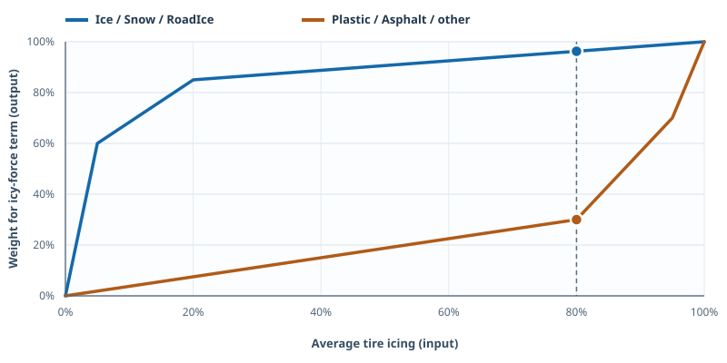

# Trackmania ice physics research

This repository reverse engineers how Trackmania's ice physics decide grip, starting with the instant ice-slide grip players call "gorilla grip". It contains the [mechanism report](outputs/gorilla_grip_mechanism.md), a shorter [player guide](outputs/gorilla_grip_player_guide.md), follow-up measurements, and the scripts used, all for the current Trackmania physics build. The report identifies a car-level slide direction that changes only while a wheel touches the ground, when smoothed steering passes ±0.1. Each change holds a tire-force multiplier at 1.0 for 400 ms; it then ramps up per touching front wheel and reaches its full value by 800 ms. The report also covers the 300 ms neutral timeout, tire icing on plastic, and the physics-tick fields the Trainer uses for timing.

Follow-up measurements, on the same build:

- [How speed limits the recovered tire force](outputs/speed_force_curve.md), including [why the force dips after a plastic section](outputs/speed_force_curve.md#plastic-sections)
- [What an early countersteer costs before a jump](outputs/countersteer_lead_cost.md)
- [Early countersteer on short hops](outputs/countersteer_short_hops.md)

## Interactive graphs

**[Open the interactive graphs](https://teuflum.github.io/tm-ice-physics-reverse-engineering/)** in your browser. GitHub shows `graphs/interactive.html` as source code, so the page is published with GitHub Pages instead; it updates on every change to `graphs/` on `main`. To use it offline, download or clone the repository and open [graphs/interactive.html](graphs/interactive.html). It needs no install or external scripts. Eight interactive graphs let you change the icing level, wetness, takeoff contact deadline, steering amount, speed and front-wheel angle, time before landing, and neutral-steering duration, and step through a measured replay over a plastic flick. The page keeps **tire icing**, **the weight of the icy tire-force contribution**, **stored direction**, and **the tire-force multiplier** visibly separate.

The SVG previews open directly on GitHub:

- [Icing versus force weight](graphs/static/icing-force-mix.svg)
- [Icing buildup and decay](graphs/static/icing-over-time.svg)
- [Steering threshold before takeoff](graphs/static/steering-before-takeoff.svg)
- [Force target versus steering](graphs/static/steering-force-target.svg)
- [Force target versus speed](graphs/static/speed-force-target.svg)
- [Force recovery after a direction change](graphs/static/force-recovery.svg)
- [300 ms neutral-steering timeout](graphs/static/neutral-steering-timeout.svg)
- [Wheel angle and travel direction over a plastic flick](graphs/static/plastic-flick-angles.svg)
- [Force dip after a plastic flick](graphs/static/plastic-flick-force.svg)

At the dotted 80% icing example, the blue curve gives the icy-force term a **96.25% weight** on Ice/Snow/RoadIce, while the orange curve gives it a **30% weight** on Plastic/Asphalt. The remaining weight goes to an ordinary force contribution in this calculation. Neither number is total grip or speed.

The charts use the tested build's values and state their simplifying assumptions. Run `node --test graphs/model.test.js` to check the numerical examples and `node graphs/export-static.js` to regenerate the SVG previews from the interactive renderer.

## Related plugin

[Gorilla Grip Trainer](https://github.com/Teuflum/Gorilla-Grip-Trainer) is the player-facing Openplanet plugin built on these findings. It reads the fields described in the report, dates takeoff to the 10 ms physics tick, and grades how early the slide direction switched before the last wheel left the ground.

## Included

- `outputs/GorillaGripLogger/`: an Openplanet logger for visible vehicle and wheel telemetry. It requires the Openplanet **VehicleState** dependency.
- `work/tick_client.py`, `work/tick_events.py`, `work/setup_tick_automation.py`, and `work/auto_trials.py`: local TICK API access and automated replay variants.
- `work/tick_restart.py`: restarts the current race so TICK replays the loaded input (Delete, plus Enter on the finish screen), and exposes a live TICK telemetry tracker for experiment scripts. It sends keys to the game window; it does not read or write game memory.
- `work/scan_live_vehicle.py`, `work/capture_live_phy.py`, `work/capture_takeoff_memory.py`, and `work/analyze_phy_memory.py`: read-only vehicle-memory capture and analysis. The capture tools use Windows `ReadProcessMemory`; they never write to game memory.
- `work/create_*variants.py` and `work/analyze_jump3_trials.py`: controlled steering variants and landing-speed comparison.
- `work/create_neutral_trial.py` and `work/analyze_neutral_capture.py`: 100 ms and 400 ms neutral-steering experiments on grounded ice.
- `outputs/TICK_baseline_right.txt`: the baseline TICK input for the report's map. `outputs/TICK_right_12_from_1126_through_1131.txt` is its `+12` variant from the controlled pair, and `outputs/TICK_neutral_100ms_ice.txt` and `outputs/TICK_neutral_400ms_ice.txt` hold the extra steering actions for the neutral experiments.
- `work/jump1_lead_trials.py`, `work/countersteer_lead_trials.py`, `work/short_hop_lead_trials.py` and their `work/analyze_*_lead.py` scripts: the early-countersteer experiments. `outputs/TICK_short_hops_baseline.txt` is the input replayed for the short hops.
- `work/analyze_tarmac_capture.py`: prints force-multiplier and mode changes in the clean-tarmac capture.
- `work/analyze_plastic_flick.py`: predicts the force target on every frame of a Logger CSV and compares it with the Trainer's logged force for the same replay; `--js` regenerates `graphs/plastic-flick-data.js`.
- `work/inspect_model_curves.py` and `work/FlixInspect/`: read-only model-curve and GBX map/ghost inspection. The latter uses GBX.NET through .NET 10.
- `work/scan_float_code_refs.py` and `work/ghidra_scripts/`: scripts used to locate and inspect the physics branch in a locally obtained game binary.

## Reproducing a local experiment

These are research scripts for the specific map and replay used in the report, rather than a packaged Openplanet release. You need your own legally obtained Trackmania installation, the map/replay, TICK, Openplanet, and VehicleState. Ghidra is needed only for the code-inspection scripts. `scan_float_code_refs.py` uses Python packages `pefile` and `capstone`.

1. Install `outputs/GorillaGripLogger` as an Openplanet script and ensure VehicleState is available.
2. Review the map UID and collection settings in `work/setup_tick_automation.py`, then run it once. It loads `outputs/TICK_baseline_right.txt` as the baseline revision. It writes `work/tick_automation_state.json` locally.
3. Generate variants with the relevant `work/create_*variants.py` script, then run `work/auto_trials.py <variant-names>`. The TICK client reads its key from TICK's local runtime configuration at execution time. No key is stored in this repository.
4. For a physics-memory check, first locate the current vehicle object with `work/capture_live_phy.py`; then use that process ID and object address with `work/capture_takeoff_memory.py`. The address changes when the game restarts. Analyze the captured file with `work/analyze_phy_memory.py`.
5. To list material and icing transitions from a map and a ghost, run `dotnet run --project work/FlixInspect/FlixInspect.csproj -- <map.Map.Gbx> <run.Ghost.gbx>` using your own files.

The scripts have case-specific coordinates, action times, and internal addresses. Verify those before using them with a different map or game build. Full telemetry logs, memory snapshots, and decompilations remain in the original local workspace. They are deliberately not redistributed here, along with `Trackmania.exe`, the map, the replay, ghost, downloaded tools, and third-party source trees.

The Gorilla Grip Logger starts idle on load. Manual buttons start a trial; a fresh automation command can still start an automated one. It ignores a command left in storage from a previous session. Its `FLSteerAngle`/`FRSteerAngle` columns are visual wheel angles, not the normalized internal steering field used for the ±0.1 mode decision; see the report for the direct physics-memory comparison.

`work/test_rater_in_game.py` is the test harness of the prototype Rater used during this research, kept as a record of the controlled +13/+12 comparison; the Rater's source is in the Git history. The stored force multiplier can read `1.00x` in air and update to `2.00x` on contact: it is part of the tire-force calculation, not a speed or acceleration reading.
